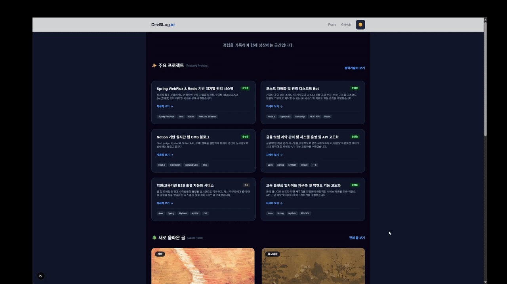
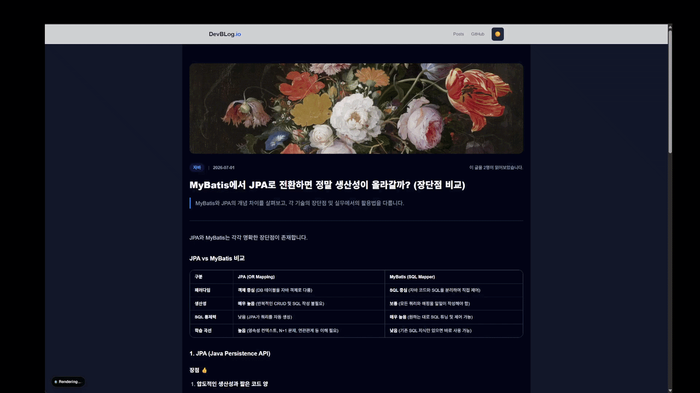
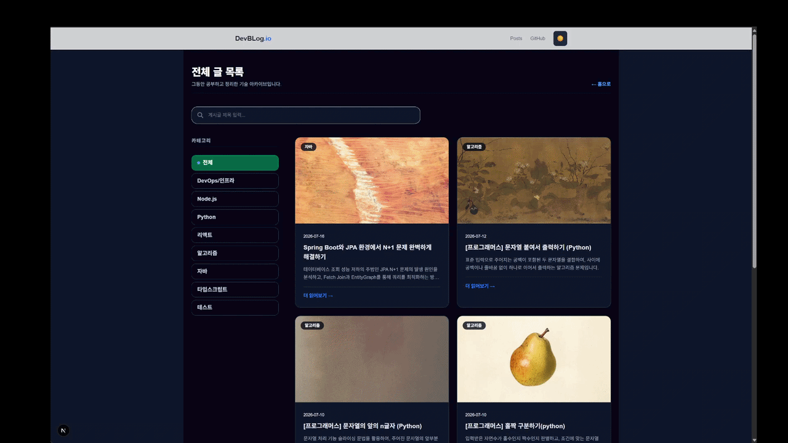
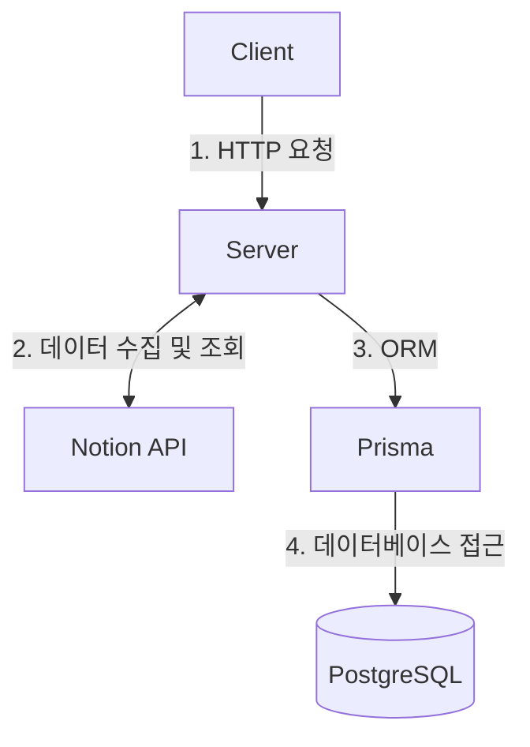

# Dev Blog

> **기술 블로그**  
> Notion을 CMS로 활용하여 반응형 UI 및 최적화된 블로그 생태계를 구현한 프로젝트입니다.

---

## 1. 프로젝트 요약

- **개발 기간:** 2026.06.14 ~ 2026.07.21
- **개발 인원:** 개인 프로젝트
- **주요 기능:**
    - Notion 변경시 웹훅 연동으로 즉시 배포
    - Markdown/Notion 랜더러 및 Shiki 기반 구문 강조
    - 커서 페이징, 카테고리 필터링 및 게시글 검색 기능
    - Giscus 기반 GitHub 댓글 연동 및 게시글 좋아요/조회수 집계 시스템
    - Contact(사용자 문의) 폼 전송 및 Nodemailer 이메일 발송
- **프로젝트 목표:** Notion CMS 기반의 고성능 기술 블로그 구축, SEO 및 사용자 경험 최적화

---

## 2. 배포 및 결과물

| 분류            | 설명                                                                      |                                 이미지                                  |
|:----------------|:--------------------------------------------------------------------------|:-----------------------------------------------------------------------:|
| **메인**        | 개발자 프로필, 핵심 역량, 경력 타임라인 및 주요 프로젝트 소개 카드로 구성 |     |
| **포스트 목록** | 카테고리 태그 필터링, 게시글 제목 검색 및 페이징 처리                     |    |
| **포스트 상세** | Notion 블록 랜더링, 이미지 모달 줌, 좋아요 기능                           |  |
| **댓글**        | Giscus 연동 GitHub 댓글 시스템                                            |             |

---

## 3. 트러블슈팅 및 문제 해결 경험

### 사례 1. CORS 및 Preflight 요청 처리 및 Next.js 미들웨어 보안 처리
- **문제 상황:** 프론트엔드 및 관리자 경로 진입 시 CORS 에러가 발생하거나, 관리자 토큰 검증 요청 중 Preflight(OPTIONS) 및 미들웨어 충돌로 401/403 에러가 반환됨.
- **원인 분석:** 브라우저가 실제 요청 전 보내는 OPTIONS 예비 요청에 대해 보안 인증 필터 및 토큰 검증 로직이 동시 수행되면서 인증 토큰 부재로 예외가 발생함.
- **해결 방법:** 미들웨어 및 API 핸들러 상단에 예외 조건문을 추가하여 OPTIONS 및 정적 파일 경로 요청을 검증 로직 없이 패스 처리하도록 수정함.

### 사례 2. DB / Notion API 비동기 조회 및 캐싱 미적용으로 인한 메모리 사용 급증
- **문제 상황:** 단순 게시글 및 카테고리 조회 요청이 집중될 때 external API 호출 오버헤드로 응답 속도가 떨어지고 서버 CPU/메모리 사용량이 급증함.
- **원인 분석:** 매 요청마다 노션 API 데이터 및 Prisma DB의 조회수를 렌더링 스냅샷 단계에서 반복 수집하고 비효율적인 동기화 처리가 실행됨.
- **해결 방법:** 조회 전용 서비스 메서드 최적화 및 정적 생성(ISR) 기법을 적용하여 외부 API 및 DB 접근 횟수를 최소화함.

### 사례 3. 노션 블록 중첩 데이터 손실 문제 발생
- **문제 상황:** 노션 본문 내 콜아웃이나 리스트, 테이블 내부의 자식 데이터가 렌더링될 때 하위 블록들이 한꺼번에 누락되는 문제 발생.
- **원인 분석:** Notion API의 기본 조회 방식은 1단계 깊이의 블록만 가져오므로, `has_children` 옵션이 설정된 하위 데이터가 강제 누락됨.
- **해결 방법:** 재귀적 블록 순회 로직(`fetchAllChildBlocks`)을 구현하여 모든 하위 블록을 재귀적으로 수집하고 HTML 랜더링에 반영하도록 최적화함.

---

## 4. 성능 최적화 경험

### 사례 1. Offset 기반 페이징의 성능 저하 및 Cursor 기반 페이징 전환
- **문제 상황:** 게시글 페이지 수가 늘어날수록 뒤쪽 페이지 조회 시 DB 및 Notion API 응답 속도가 느려짐.
- **원인 분석:** Offset 방식은 앞선 N개의 행을 순회 탐색한 뒤 결과를 추출하므로, 데이터 양에 비례하여 I/O 비용이 급증함.
- **해결 방법:** Cursor 기반 페이징으로 전환하여 페이지 탐색 성능을 $O(1)$ 수준으로 최적화함.

### 사례 2. 본문 구문 강조 및 와일드카드 검색 쿼리 성능 개선
- **문제 상황:** 코드 블록 라이브러리 및 게시글 검색 기능 실행 시 브라우저 렌더링 및 응답 속도가 떨어짐.
- **원인 분석:** 클라이언트 단의 과도한 파싱 작업 및 와일드카드 검색 쿼리가 B-Tree 인덱스를 탈 수 없어 Full Scan이 발생하는 구조적 문제.
- **해결 방법:** Shiki 싱글톤 하이라이터 인스턴스 구축으로 서버 단 고속 파싱을 수행하고, 정확한 키워드 필터 구조를 적용해 렌더링 성능을 개선함.

---

## 5. 기술 스택

| 구분         | 기술 스택                                               | 선택 이유                                                                                                                     |
|:-------------|:--------------------------------------------------------|:------------------------------------------------------------------------------------------------------------------------------|
| **Frontend** | Next.js(App Router), React 19, TypeScript, Tailwind CSS | 정적 페이지 생성(SSG)과 동적 갱신(ISR)을 조합하여 Notion 데이터의 실시간성과 렌더링 성능을 동시에 확보하기 위해 도입했습니다. |
| **Backend**  | Node.js, Next.js Server Actions / API Routes            | 별도의 백엔드 서버 구축 없이 Serverless 인프라 위에서 효율적인 데이터 페칭 및 API 요청 처리                                   |
| **Database** | PostgreSQL, Prisma ORM 7.8                              | 안정적인 데이터베이스 조작, SSL 동적 제어 매핑 및 타입 안정성 확보                                                            |
| **CMS/Auth** | Notion API                                              | CMS로서의 Notion 활용성                                                                                                       |

---

## 6. 시스템 아키텍처 및 데이터 흐름

## 7. API 명세서

### 포스트 및 카테고리
| 요청 메서드 | 엔드포인트          | 기능 설명                                    |
|:------------|:--------------------|:---------------------------------------------|
| `GET`       | `/api/posts`        | 포스트 목록 조회 (Cursor 페이징, 검색, 태그) |
| `GET`       | `/api/posts/{slug}` | 포스트 상세 정보 및 본문 HTML 조회           |
| `GET`       | `/api/categories`   | 전체 카테고리 목록 조회                      |

### 인터랙션 (조회수 및 좋아요)
| 요청 메서드 | 엔드포인트                | 기능 설명                  |
|:------------|:--------------------------|:---------------------------|
| `POST`      | `/api/posts/{slug}/views` | 게시글 조회수 증가 처리    |
| `POST`      | `/api/posts/{slug}/likes` | 게시글 좋아요 수 증가 처리 |

### 문의
| 요청 메서드 | 엔드포인트     | 기능 설명                     |
|:------------|:---------------|:------------------------------|
| `POST`      | `/api/contact` | 사용자 문의 작성 및 메일 발송 |

### 관리자
| 요청 메서드 | 엔드포인트         | 기능 설명                  |
|:------------|:-------------------|:---------------------------|
| `POST`      | `/api/admin/login` | 관리자 로그인 및 토큰 발급 |

---

## 8. 향후 개선 계획 및 배운 점

**개선 계획**
* 포스트 내 목차 자동 생성 기능 추가

---

**배운 점**
* **컴포넌트 역할별 분리**
    * 불필요한 클라이언트 번들 크기를 줄이고, 데이터 조회는 서버에서 처리하여 초기 로딩 속도를 개선하는 방법에 대해 배웠습니다 
    * 3초 이상 걸리던 로딩시간이 컴포넌트 분리 후 1초 이내로 단축되었습니다.

* **On-Demand Revalidation 적용**
    * 웹훅과 연동하여 데이터가 실제 변경될 때만 특정 경로 캐시를 갱신함으로써 서버 자원 소모를 방지하는 방법을 터득했습니다.
    * 매번 주기적인 배포를 수행하지 않고 기능이 수정되었을 때만 갱신하도록 설계하여, 불필요한 서버 빌드 횟수 및 자원 소모를 90% 이상 절감했습니다.
* **커서기반 페이징 구현**
    * 데이터량이 많아질 때 Offset 페이징의 성능 저하 문제를 고려해서, 적합한 커서 기반 페이징 알고리즘을 구축했습니다.
    * 대용량 데이터 탐색 시 발생하던 응답 지연을 방지하고, 페이지 깊이에 상관없이 일정한 수준의 조회 속도를 확보했습니다.
* **Sitemap 자동화 및 Google Search Console 사용**
    * 포스트 작성/수정 시 동적으로 Sitemap이 업데이트되도록 작성하여 검색 엔진 크롤러의 수집 효율을 최대화했습니다.
    * 구글 검색 엔진 크롤러의 수집 효율을 높여 1주 이상 걸리던 신규 포스트의 검색 엔진 색인 반영 시간을 1일 이내로 단축시켰습니다.
---

## 9. 연락처

* **이메일:** podojjang_kr@naver.com
* **GitHub:** https://github.com/codes-gy
* **블로그:** https://dev-blog-topaz-rho.vercel.app/