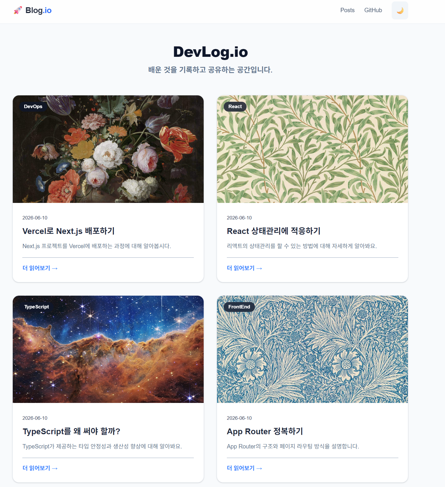

#  Notion API 연동 Next.js 기술 블로그

노션(Notion) 데이터베이스를 헤드리스 CMS(Headless CMS)로 활용하여, 노션에서 글을 작성하고 관리하면 Next.js 블로그에 실시간으로 아름답게 렌더링되는 모던 웹 애플리케이션 프로젝트입니다.

---

## 🛠️ Tech Stack (기술 스택)

- **Framework**: Next.js (App Router)
- **Styling**: Tailwind CSS v4 (with `@tailwindcss/typography`)
- **CMS**: Notion API (`@notionhq/client`, `@notion-render/client`)
- **Language**: TypeScript
- **Deployment**: Vercel

---

## 📡 Notion CMS 연동 아키텍처

이 프로젝트는 노션 데이터베이스의 특정 상태를 감지하여 블로그 포스트를 동적으로 빌드합니다.

### 1. 데이터베이스 스키마(Properties) 구조
노션 데이터베이스에서 블로그 콘텐츠를 긁어오기 위해 아래와 같은 속성을 기반으로 동작합니다:

| Property 명 | Type | 역할                                        |
| :--- | :--- |:------------------------------------------|
| **title** 또는 **Title** | `Title` / `RichText` | 블로그 게시글의 제목                           |
| **Slug** | `RichText` | URL 주소창에 들어갈 고유 식별자 (`/api`,`/docs`)     |
| **Summary** | `RichText` | 포스트 목록 및 상세 상단에 노출될 이탈릭체 요약문              |
| **Category** | `Select` | 글의 카테고리 태그 (e.g., `개발`, `디자인`, `일상`)      |
| **Published** | `Checkbox` | `true`(체크됨) 상태일 때만 블로그 화면에 노출             |
| **PublishedAt** | `Date` | 한국형 포맷(`YYYY년 MM월 DD일`)으로 변환되어 출력될 포스팅 날짜 |

### 2. 데이터 흐름 (Data Flow)

1. Notion CMS (노션 데이터베이스에서 `Published` 체크박스를 활성화합니다)
2. GitHub Repository (Next.js 소스코드를 저장하고 Vercel 배포 트리거를 동기화합니다)
3. Vercel Cloud (GitHub의 코드를 기반으로 무중단 빌드하며, 새 글을 실시간 동기화합니다)

---

##  시작하기

### 1. 환경 변수 세팅 (`.env`)
프로젝트 최상위에 `.env.local` 파일을 생성하고 노션 API 연동 키를 입력합니다. (이 파일은 Git 에서 제외됩니다.)

```env
NOTION_API_KEY=your_notion_secret_api_key_here
NOTION_DATABASE_ID=your_notion_database_id_here
```
### 2. 실행
프로젝트를 구동하는 명령어입니다.
```bash
1. 의존성 패키지 설치
npm install

2. 개발 서버 실행
npm run dev

3. 서버 실행
npm run start
```
